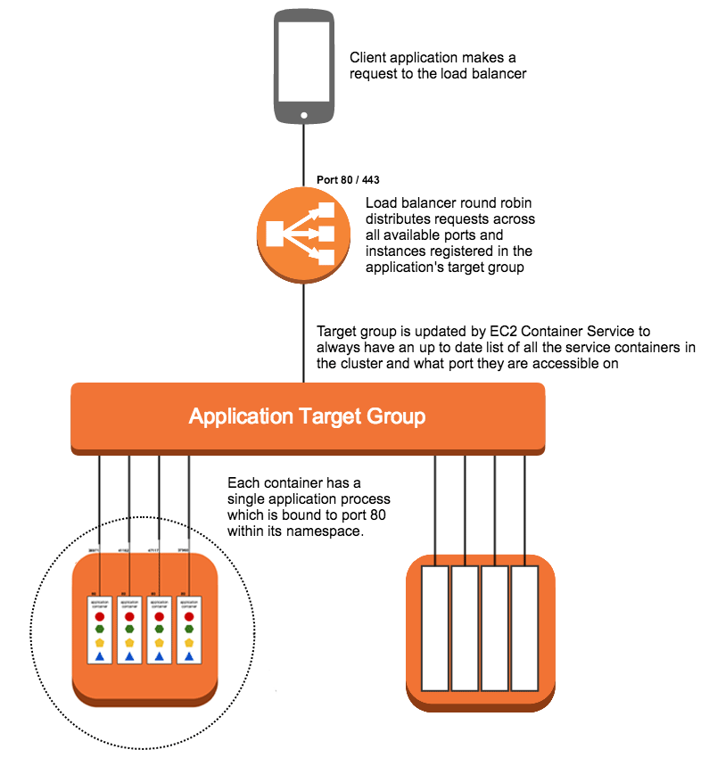
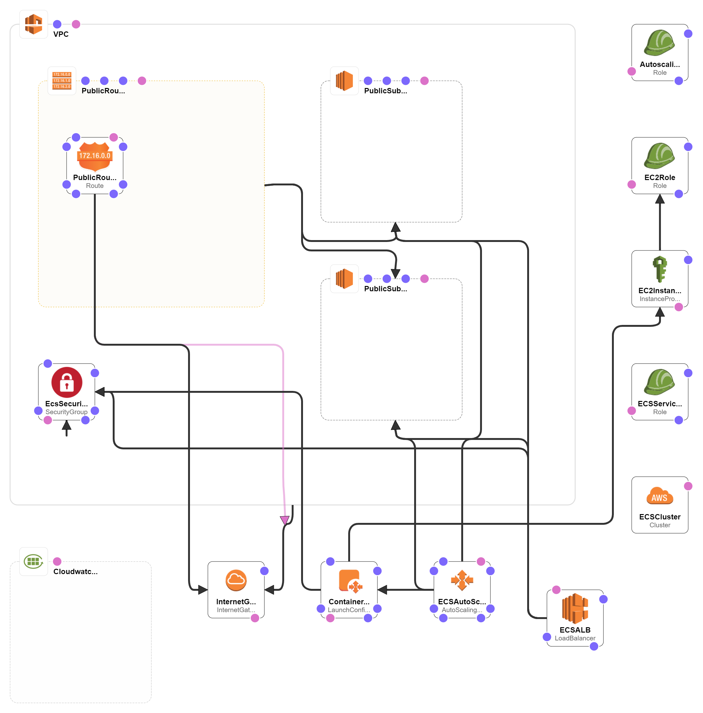

# Toy Robot Coding Exercise
## Application
The application is a simulation of a toy robot moving on a square table top, of dimensions 5 units x 5 units. There are no other obstructions on the table surface. The robot is free to roam around the surface of the table, but must be prevented from falling. Any movement that would result in the robot falling from the table must be prevented, however further valid movement commands must still be allowed.

This project is forked from this [Project](https://github.com/cowardcalf/robot-move-on-table.git).

# Setup and Run
The application is runnale and testable with Node, Yarn and in a Docker container. First clone the code the [Repository](https://github.com/sinahub/robonble.git)

### Node:
1. Install [Node.js](https://nodejs.org/en/)
1. Enter the project directory. `cd ./robonble/services/robonble`
1. Install dependencies by typing `npm install`.
1. Execute `npm test` to test the code.
1. Execute `npm start` to test the code.
1. The application is available on [localhost:3000](http://localhost:3000)


### Yarn:
1. Install [Yarn](https://yarnpkg.com/en/docs/install).
1. Enter the project directory. `cd ./robonble/services/robonble`
1. Install dependencies by typing `yarn install`.
1. Execute `yarn test` to test the code.
1. Execute `yarn start` to run.
1. The application is available on [localhost:3000](http://localhost:3000)


### Docker:
1. Install [Docker](https://docs.docker.com/get-docker/) based on your Operatin System.
1. Enter the project directory. ` cd ./robonble/`
1. run `docker build -t robonble ./services/robonble`
1. run `docker run -d -p 3000:3000 robonble`
1. The application is available on [localhost:3000](http://localhost:3000)
	

## Deploy to AWS

1. Install [Docker](https://docs.docker.com/get-docker/) based on your Operatin System.
1. Enter the project directory. ` cd ./robonble/`
1. Configure the AWS CLI: [Documentation](https://docs.aws.amazon.com/cli/latest/userguide/cli-chap-configure.html#cli-quick-configuration)
1. Launch an ECS cluster using the Cloudformation template replacing `<region>` and `<stack name>`:
   ```
   $ aws cloudformation deploy \
      --template-file infrastructure/ecs.yml \
      --region <region> \
      --stack-name <stack name> \
      --capabilities CAPABILITY_NAMED_IAM
   ```
1. Run `chmod +x deploy.sh`
1. Deploy the services onto your cluster using the following command: 
   ```
   $ ./deploy.sh <region> <stack name>
   ```
1. Get the URL once the code execution finished. 


# Architecture Diagrams

The image below shows how the node application is put into a container for deployment on EC2 Elastic Container Service.



The diagram below shows the architecture of the resources.




# Instruction
The correct commands and their format are as below.
```
PLACE X,Y,F 
MOVE  
LEFT  
RIGHT  
REPORT  
```

**PLACE** will put the toy robot on the table in position X,Y and facing NORTH, SOUTH, EAST or WEST. The origin (0,0) can be considered to be the SOUTH WEST most corner. It is required that the first command to the robot is a PLACE command, after that, any sequence of commands may be issued, in any order, including another PLACE command. The application should discard all commands in the sequence until a valid PLACE command has been executed.

**MOVE** will move the toy robot one unit forward in the direction it is currently facing.

**LEFT** and **RIGHT** will rotate the robot 90 degrees in the specified direction without changing the position of the robot.

**REPORT** will announce the X,Y and F of the robot.

## API Call
Input is from a GET API call with the following format:

```
<DNS name:url>/api/v<versin:float>/<commands:string>
```
For [Example](http://final-ecsal-n2a0jgtdruym-2086525386.ap-southeast-2.elb.amazonaws.com/api/v1.0/PLACE%202,2,NORTH%20MOVE%20MOVE%20LEFT%20MOVE%20RIGHT%20MOVE%20RIGHT%20REPORT):
```
http://final-ecsal-n2a0jgtdruym-2086525386.ap-southeast-2.elb.amazonaws.com/api/v1.0/PLACE 2,2,NORTH MOVE MOVE LEFT MOVE RIGHT MOVE RIGHT REPORT
```

```
This returns 1,4,EAST
```
### How does it gets calculated?
```
PLACE 2,2,NORTH   // 2,2,North
MOVE              // 2,3,North
MOVE              // 2,4,North
LEFT              // 2,4,WEST
MOVE              // 1,4,WEST
RIGHT             // 1,4,NORTH
MOVE              // 1,4,NORTH
RIGHT             // 1,4,EAST
REPORT            // returns the position
```

 

It's needed to PLACE the toy Robot first every time you call the API otherwise it will ignore all commands. As shown above, all commands will be splitted with a Space. 

### Constraints  
The robot must not fall off the table during movement. This also includes the initial placement of the robot. Any move that would cause the robot to fall must be ignored.

### Assumptions
1. Incorrect command would not stop the program.
1. The x/y values of placing could be decimal number.
1. If the robot is not placed then application returns `0,0,NORTH` and ignore all other commands.

## Test Data
#### Any action without placing.
```
Input:  MOVE LEFT RIGHT MOVE REPORT
Output: 0,0,NORTH
```
#### Place and valid move.
```
Input:  PLACE 0,0,EAST MOVE MOVE RIGHT REPORT
Output: 2,0,SOUTH

Input:  PLACE 2,3,NORTH MOVE LEFT REPORT
Output: 2,4,WEST
```
#### Place and valid turn & move
```
Input:  PLACE 1,2,EAST MOVE LEFT MOVE RIGHT MOVE MOVE RIGHT REPORT
Output: 4,3,SOUTH

Input:  PLACE 4,4,NORTH LEFT MOVE MOVE LEFT MOVE LEFT REPORT
Output: 2,3,EAST
```
#### Place and invalid turn & move
```
Input:  PLACE 0,0,WEST MOVE MOVE LEFT MOVE REPORT
Output: 0,0,SOUTH

Input:  PLACE 4,4,NORTH MOVE RIGHT MOVE MOVE REPORT
Output: 4,4,EAST

Input:  PLACE 3,0,EAST MOVE RIGHT MOVE LEFT LEFT MOVE REPORT
Output: 4,1,NORTH
```
#### Place after few of actions
```
Input:  MOVE LEFT MOVE RIGHT MOVE PLACE 2,4,WEST REPORT
Output: 2,4,WEST

Input:  MOVE RIGHT RIGHT MOVE MOVE PLACE 1,3,SOUTH MOVE LEFT MOVE REPORT
Output: 2,2,EAST
```
